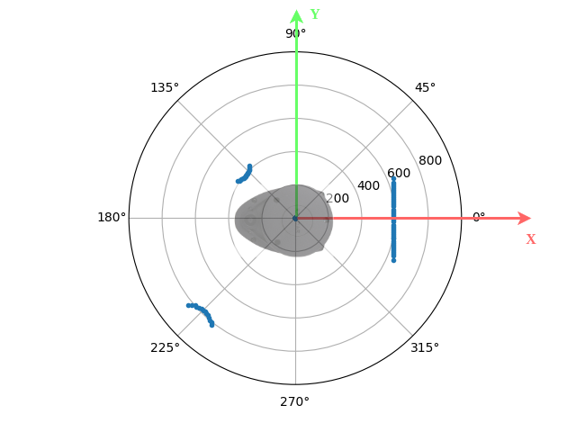

[](https://classroom.github.com/a/DjqqBwtK)
# LiDAR Scan

## Objetives
- Explore usage of [RPLIDAR A1](https://www.slamtec.com/en/lidar/a1) with a Python [library](https://github.com/adafruit/Adafruit_CircuitPython_RPLIDAR).
- Visualize LiDAR scan data.
- Polar and Cartesian coordinates conversion.

## Requirements
Place the LiDAR at designated location, start to scan and analyze the data.

### 1. (80%) LiDAR Scan Visualization
Complete [plot_scan.py](plot_scan.py) to achieve following requests.
1. (10%) Complete at least 1 successful scan in 360 degrees with 100+ non-zero distance samples. 
2. (20%) Plot the data points from last successful scan under the polar coordinate system. Only plot the data points within 0 to 1 meter range.
3. (10%) Save the plot as a image file (PNG or JPG) in this repository.
4. (40%) Log distance samples at 0, 135, and 225 degrees and the corresponding Cartesian coordinates under the frame set as shown in the figure below.
- Distance at 0 deg: 0.618 m, Cartesian coordinates: (0.618, 0) m.
- Distance at 135 deg: 0.553 m, Cartesian coordinates: (-0.391, 0.391) m.
- Distance at 225 deg: 0.791 m, Cartesian coordinates: (-0.559, -0.559) m.

**Note:** The RPLIDAR A1 spins clockwise, but the polar plot use counter-clockwise as the default angle increasing direction. 
So, you may want to **reverse** the distance samples list when plot the data. 



#### Hints
- [Matplotlib](https://matplotlib.org/) installation
```console
# Run following line in terminal
pip install matplotlib --break-system-packages
```
- Polar plot [example](https://matplotlib.org/stable/gallery/pie_and_polar_charts/polar_demo.html)

### 2. (20%) Convert Polar coordinates to Cartesian coordinates 
Describe the conversion rule (from polar to Cartesian) using math language.
1. Please follow the frame setup shown in the figure above.
2. (10%) Define/Explain (4) symbols for general representations of (a pair of) polar coordinates and Cartesian coordinates.
   
   There are four symbols that define both polar coordinates and cartesian coordinates. In polar there is (R) and (Theta). R is the distance of the vector from the origin to the point seen by the lidar. Theta is the angle of R. Theta is measured counter clockwise from 0 degrees In Cartesian there is (X) and (Y). X is the horizontal distance from the origin to the point being measured. Y is the vertical distance from the origin to the point being measured.
   
3. (10%) About 2 equations are expected.
   $'X = R\cos(\theta)'$
   $'Y = R\sin(\theta)'$

## AI Policies
Please acknowledge AI's contributions follow the policies in the syllabus.
